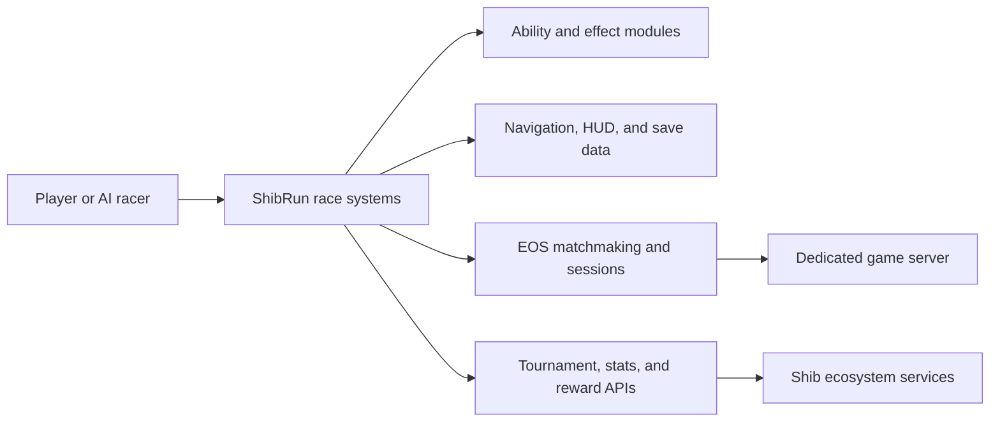

# LapDogs

  

  <strong>Multiplayer racing, character abilities, competitive events, and live-service integrations in Unreal Engine 5.</strong>

LapDogs is an online kart-racing game created for the Shiba Inu ecosystem. Shiboshi and Sheboshi avatars compete in class-based races with Grand Prix events, AI rivals, matchmaking, live leaderboards, and tournament integrations.

This repository is a source-code portfolio showcase of the C++ systems behind the game. For the full visual case study, screenshots, and gameplay videos, visit [LapDogs at Rebel Art Studios](https://rebelartstudios.org/project/lap-dogs).

## Visual showcase

  
  

  

## Engineering highlights

- Networked client and dedicated-server racing with synchronized race-state transitions
- Epic Online Services authentication, matchmaking, sessions, and cross-platform account flows
- Configurable Grand Prix events with multiple tracks, rounds, final races, and leaderboards
- AI racers that fill open session slots and navigate track-specific waypoints and obstacles
- Character classes with primary and secondary abilities, effects, attributes, and modifiers
- Custom drifting and network-predicted character movement
- Pickups, hazards, checkpoints, lap timing, player statistics, and spectator cameras
- Tournament, reward, payment, and metaverse service integrations
- Modular UI navigation, save data, loading screens, and runtime content chunking

## System architecture

## Technology

- Unreal Engine 5.4
- C++ with Blueprint extension points
- Enhanced Input, Gameplay Tags, and Gameplay Tasks
- Niagara and UMG
- Epic Online Services through Redpoint EOS
- Client, game, editor, and dedicated-server build targets

## Repository map

| Path | Responsibility |
| --- | --- |
| `Source/ShibRun/` | Racing, character, AI, multiplayer state, input, and gameplay code |
| `Plugins/AbilitySystem/` | Abilities, effects, attributes, and modifiers |
| `Plugins/ShibMetaverseEOS/` | Authentication, matchmaking, and session management |
| `Plugins/ShibAPIs/` | Player statistics, tournament, payment, and metaverse APIs |
| `Plugins/ShibUiNavigation/` | UI navigation and save-game systems |
| `Plugins/ShibAsyncLoadingScreen/` | Startup and map loading screens |
| `Plugins/ShibChunkingSystem/` | Runtime content chunk management |
| `Config/` | Engine, input, platform, packaging, and gameplay-tag configuration |

## Repository scope

The repository contains selected game modules, configuration, and custom plugins. It does not include the complete `Content/` directory, proprietary art, production credentials, or licensed Marketplace dependencies, so this checkout is not a standalone playable build.

Authorized contributors need Unreal Engine 5.4, a compatible C++ toolchain, the private content depot, team-managed service configuration, and the external plugins referenced by `ShibRun.uproject`. After restoring those dependencies:

1. Generate project files from `ShibRun.uproject`.
2. Build the `ShibRunEditor` target.
3. Open the project in Unreal Editor.
4. Use the appropriate client or dedicated-server target for packaged multiplayer builds.

## Related project

LapDogs is part of the same technical ecosystem as [Shib: The Metaverse](https://github.com/Elia-Youssef/ShibTheMetaverse), sharing patterns for identity, multiplayer sessions, service integration, and content delivery.

## Ownership and licensing

Copyright notices in the source identify Shiba Inu Games LLC. No open-source license is included. Unless a separate agreement grants permission, the source is provided for viewing and portfolio reference only.
